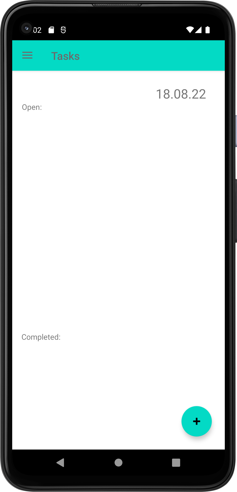
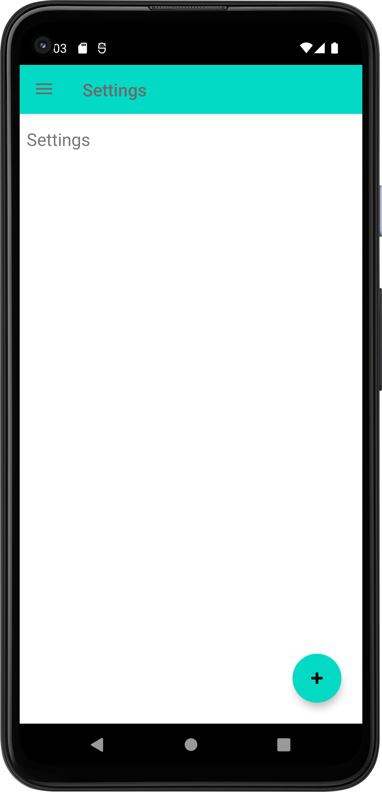

# DailyTasksApp

## Table of contents
* [General info](#general-info)
* [Technologies](#technologies)
* [Screenshots](#screenshots)
* [Launch](#launch)

## General info
This App will help you organize all your daily tasks by notifying you throughout the day, giving you suggestions for open tasks and keeping everything clean and in one place.

## Technologies
The App is still in Prototype phase and misses a lot of the features I want it to have. I will keep working on it until the 1.0 version to then publish it on the Playstore.

## Screenshots
Below are some Screenshots of the current look and progress I made so far:

## Launch
To test the app yourself just download the APK file in the "APK" Folder and transfer it to your phone. Once that is done, enable the security setting to accept installation of third party providers. Now you should be good to go :)
